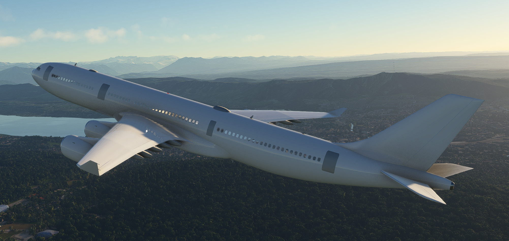
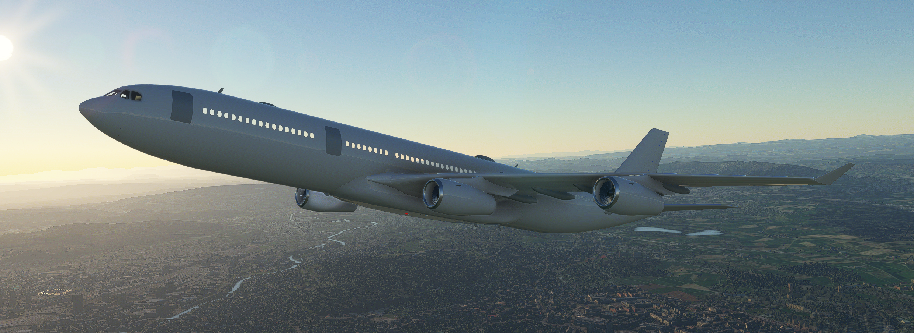

# EGLCSimulations - A340-313E

### Aircraft in this Addon

 ```
 Model       A340-313E
 Engine      CFM56 5C4/P
 ```

## Pictures





## Contributing

If you have experience in texturing, programming or MSFS Addon developpment please consider joining my Discord Server:
https://discord.gg/BtaCxfPw

## License Information

Microsoft Flight Simulator 2020 © Microsoft Corporation. The EGLCSimulations A340-313E was created under Microsoft's "Game Content Usage Rules" using assets from Microsoft Flight Simulator 2020, and it is not endorsed by or affiliated with Microsoft. 

EGLCSimulations A340-313E © 2023 by EGLCSimulations is licensed under CC BY-NC-SA 4.0 
https://creativecommons.org/licenses/by-nc-sa/4.0/?ref=chooser-v1

## Q&A

Where can I download this Addon?
-The A340-313E is still in early development and isn't yet ready for use in MSFS.
-The files you can download on this repository are used for developing the Aircraft in the Developer Mode in MSFS. 

When will I be able to download this Addon?
-As soon as I think the A340-313E is ready for use, you will be able to download it under releases.

What can the Aircraft do at the moment?
-The Aircraft is somewhat flyable using A320neo systems which are being modified.
-It features a custom flightmodel and a from ground up modeled Cockpit and exterior.

What are you planning on adding?
-I am planning on adding many things. For example:
-Custom Sounds, Wingflex, multiple missing Systems, Failures etc.